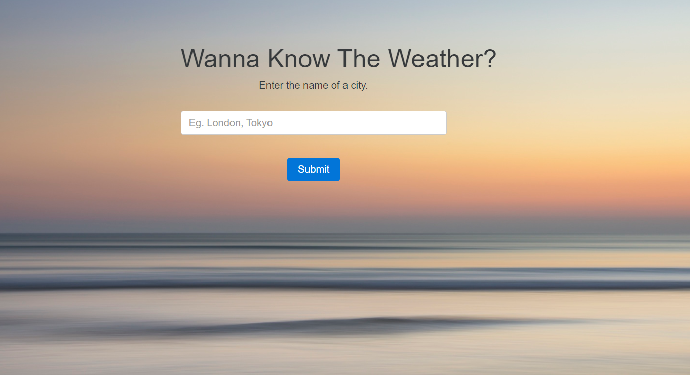

# My-Weather-Scraper
My weather scraper is a responsive web application which is used to know the weather condition of a city built using php.

<h2>Approaches</h2>

<ul>
  <li>By stealing other weather webiste's html contents. which is not recomended</li>
  
  
The first one is implemented using the contents from the site http://www.weather-forecast.com 

  
  
 The returned contents are sliced and extracted required weather desciption 

  
  <li> By using API from http://www.openweathermap.org<li>
  
  
They provide api's just by signing up 

  
  
while using file_get_contents in php, you need to append your api key to the url 

  
  
 You will get contents in json format like short description, temparature, hudmidity .. etc 

  
  
 use those data and design a nice weather desciption 

  
  
 used urlencode() for getting the city name which helps in searching any kind of city name 

  
</ul>  
  <h2>Application</h2>

 
  <h3>Approach 1 </h3>
  
  

  <h3>Approach 2</h3>
  
  
  
<h2>In action </h2>

 see this application (method 1) in action <a href="http://jayasampathwebhosting-com.stackstaging.com/projects/weather-scraper/method1/">here </a>

  

 see this application (method 2) in action <a href="http://jayasampathwebhosting-com.stackstaging.com/projects/weather-scraper/method2/">here </a>

